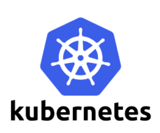
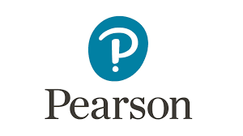
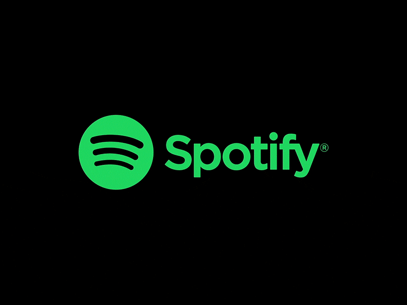
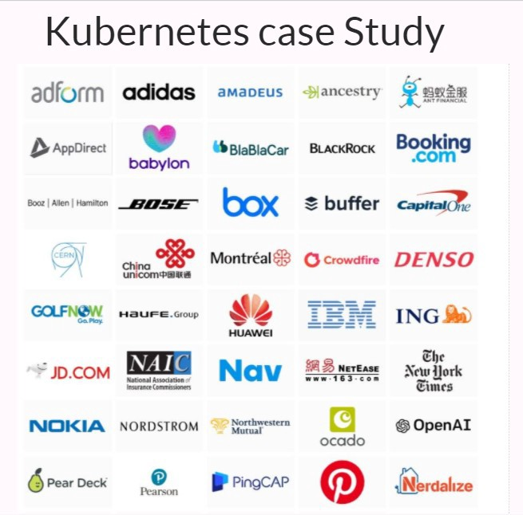

***
# ***Kubernetes Case Study***
###### ***Requirement, use and real world case study related to k8s***

***

## *What is Kubernetes?*

Kubernetes is a portable, extensible, open-source platform for managing containerized workloads and services, that facilitates both declarative configuration and automation. kubernetes is commonly stylized as k8s or kube

## *Requirement for K8s*

Containers are a good way to bundle and run your applications. In a production environment, you need to manage the containers that run the applications and ensure that there is no downtime. For example, if a container goes down, another container needs to start. Wouldn’t it be easier if this behavior was handled by a system?

That’s how Kubernetes comes to the rescue! Kubernetes provides you with a framework to run distributed systems resiliently. It takes care of scaling and failover for your application, provides deployment patterns, and more. For example, Kubernetes can easily manage a canary deployment for your system.

## *What Kubernetes provides us ?*

1. **Service discovery and load balancing** Kubernetes can expose a container using the DNS name or using their own IP address. If traffic to a container is high, Kubernetes is able to load balance and distribute the network traffic so that the deployment is stable.  

2. **Storage orchestration** Kubernetes allows you to automatically mount a storage system of your choice, such as local storages, public cloud providers, and more. Automated rollouts and rollbacks we can describe the desired state for your deployed containers using Kubernetes, and it can change the actual state to the desired state at a controlled rate. For example, we can automate Kubernetes to create new containers for our deployment, remove existing containers and adopt all their resources to the new container.  

3. **Automatic bin packing** You provide Kubernetes with a cluster of nodes that it can use to run containerized tasks. You tell Kubernetes how much CPU and memory (RAM) each container needs. Kubernetes can fit containers onto our nodes to make the best use of our resources.  

4. **Self-healing** Kubernetes restarts containers that fail, replaces containers, kills containers that don’t respond to your user-defined health check, and doesn’t advertise them to clients until they are ready to serve.  

5. **Secret and configuration management** Kubernetes lets us store and manage sensitive information, such as passwords, OAuth tokens, and SSH keys. we can deploy and update secrets and application configuration without rebuilding your container images, and without exposing secrets in your stack configuration.  

***

### ***Real World Use Cases How companies are using K8s***

### *Pearson*

***Challenge:*** A global education company serving 75 million learners, Pearson set a goal to more than double that number, to 200 million, by 2025. A key part of this growth is in digital learning experiences, and Pearson was having difficulty in scaling and adapting to its growing online audience. They needed an infrastructure platform that would be able to scale quickly and deliver products to market faster

***Solution:*** The Team realized they had to build a platform that would allow developers to build, manage and deploy applications in a completely different way. The team chose Docker container technology and Kubernetes orchestration because of its flexibility, ease of management and the way it would improve there's engineers’ productivity.

***Results:*** With the K8s as a platform, there has been substantial improvements in productivity and speed of delivery. In some cases, they shift from nine months to provision physical assets in a data center to just a few minutes to provision and get a new idea in front of a customer. According to the team they’ve achieved 15–20% developer productivity savings. Before, outages were an issue during their busiest time of year, the back-to-school period. Now, there’s high confidence in their ability to meet aggressive customer SLAs.

> ***“We’re already seeing tremendous benefits with Kubernetes — improved engineering productivity, faster delivery of applications and a simplified infrastructure. But this is just the beginning. Kubernetes will help transform the way that educational content is delivered online.”***
***- CHRIS JACKSON, DIRECTOR FOR CLOUD PLATFORMS & SRE AT PEARSON***

***

### *Spotify*

***Challenge:*** Launched in 2008, the audio-streaming platform has grown to over 200 million monthly active users across the world. “Our goal is to empower creators and enable a really immersive listening experience for all of the consumers that we have today — and hopefully the consumers we’ll have in the future,” says Jai Chakrabarti, Director of Engineering, Infrastructure and Operations. An early adopter of microservices and Docker, Spotify had containerized microservices running across its fleet of VMs with a homegrown container orchestration system called Helios. By late 2017, it became clear that “having a small team working on the features was just not as efficient as adopting something that was supported by a much bigger community,” he says.

***Solution:*** The team saw the amazing community that had grown up around Kubernetes, and they wanted to be part of that. Kubernetes was more feature-rich than Helios. Plus, they wanted to get benefited from added velocity and reduced cost, and also get align with the rest of the industry on best practices and tools. The migration, that would happen in parallel with Helios running, could go smoothly because “Kubernetes fit very nicely as a complement and now as a replacement to Helios,” says Chakrabarti.

***Results:*** The team spent much of 2018 addressing the core technology issues required for a migration, which started late that year and is a big focus for 2019. “A small percentage of our fleet has been migrated to Kubernetes, and some of the things that we’ve heard from our internal teams are that they have less of a need to focus on manual capacity provisioning and more time to focus on delivering features for Spotify,” says Chakrabarti. The biggest service currently running on Kubernetes takes about 10 million requests per second as an aggregate service and benefits greatly from autoscaling, says Site Reliability Engineer James Wen. Plus, he adds, “Before, teams would have to wait for an hour to create a new service and get an operational host to run it in production, but with Kubernetes, they can do that on the order of seconds and minutes.” In addition, with Kubernetes’s bin-packing and multi-tenancy capabilities, CPU utilization has improved on average two- to threefold.

***

## *Like this Kubernetes have Many of the stories of its customers Satisfied with it you can check them out too* [Here](https://kubernetes.io/case-studies/)
### *Thankyou For Reading : )*
### *Any query and suggestion are always welcome — [Gaurav Pagare](https://www.linkedin.com/in/pagare-gaurav/)*
